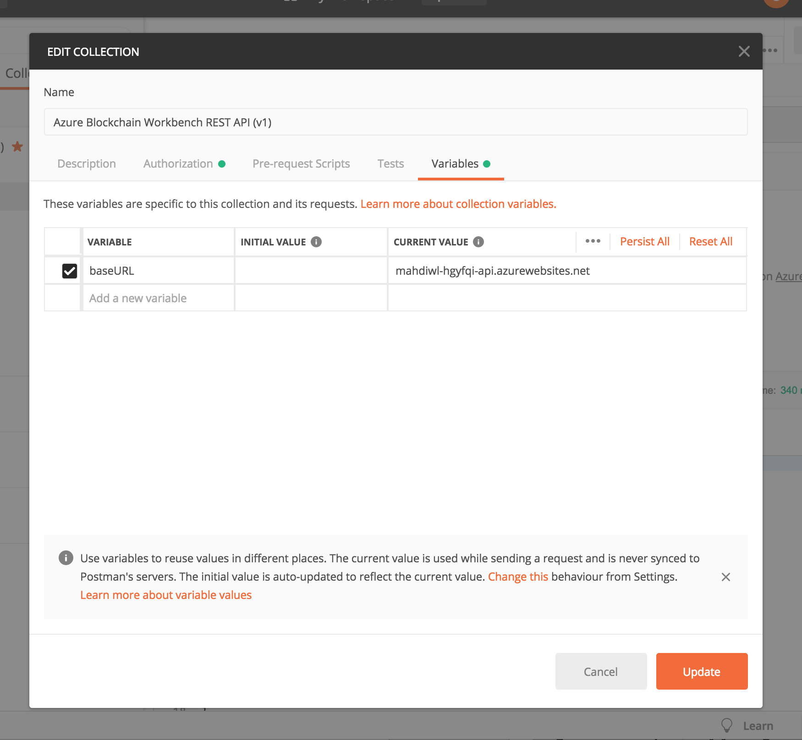
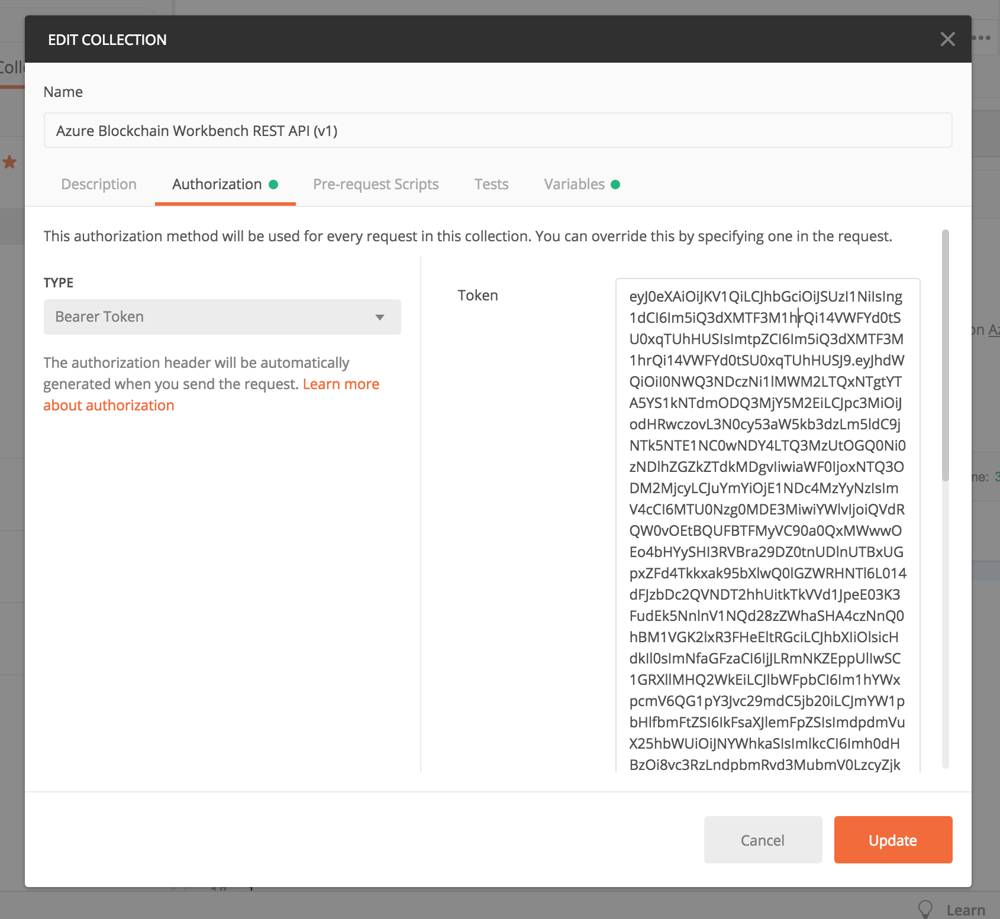

# Blockchain Workbench Functions API-API Interaction Sample

A Sample to my blogpost on medium.com on creating your own API to interact with Azure Blockchain Workbench: 

https://medium.com/@malirezaie/how-to-enable-programmatic-interaction-with-azure-blockchain-workbench-apis-56c0d95c79c0

For added reference - download the Postman collection in the postman folder and import it. You can set the auth header for the entire collection and also change the API URL as well:

